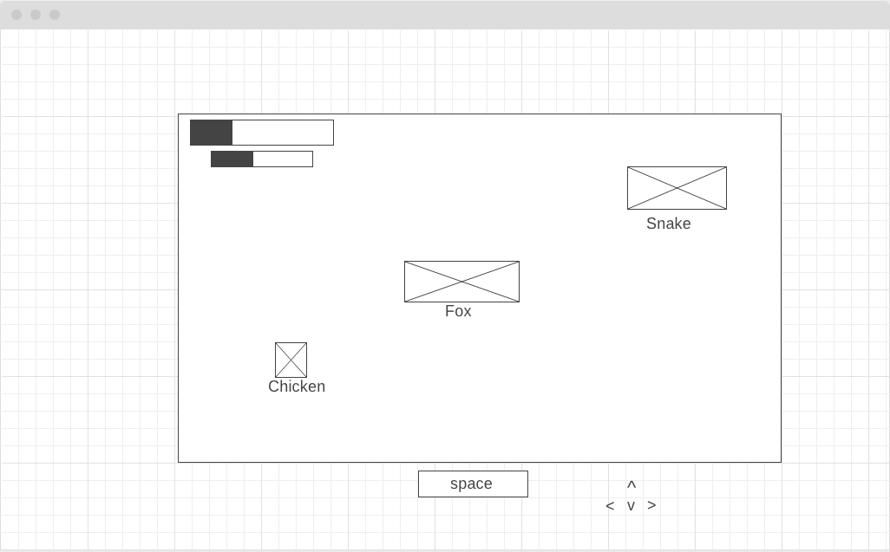
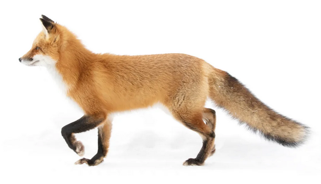

## OutFoxed

### Background & Overview

Outfoxed will be a top-down, zelda inspired game with a little fox guy as the playable charater. He'll run around the screen, taking out enimies who will be chickens and/or snakes and/or dogs. Attacking will be a thing for sure. I'm torn between defending or stealth as a mechanic. Would also like to include a power up that gives him a special attack or the ability to go invisible. I think the fox is the best animal. 

Also, if this idea is no good for some reason, could have a game where the fox sits in the middle of the screen, and chickens are running at him from all sides, and you click around him and he spits out fireballs that cook the chickens. This one would obviously need a click event listener instead of arrow or WASD controlls.

### Functionality & MVPs
- User can control the fox with keyboard, moving him around the screen
- Can use space bar to attack in front of him
- Can use the shift key to either defend or hide
- Eatting a chicken would resotre health
- Would like to have catchy chip-tune music

### Wireframe
I'm going to try to insert the wireframe I made here

Here's a fox

### Timeline

I'm really not sure how to aproach a timeline on this. Based on Friday's presentation I would say the first 2 days will be planning and reasearching. I think making the brickbreaker today (Monday) would be a good use of time. Willing to work on this next weekend and nex week as well. I feel like I'll be pretty emotionally invested.
